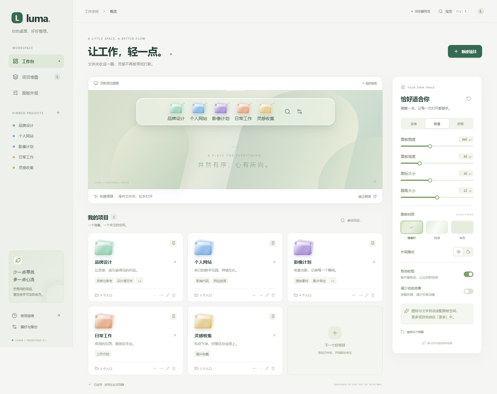

# Luma Quick Launch · 项目触手可及

局部顶边浮岛、强磨砂、水晶项目文件夹堆叠。长按展开，滑向目标，松手打开。

**状态：第六轮新增已有窗口复用，并修复深色标题栏、控件与设置留白。** 最新验证与支持边界见 [第六轮修复报告](docs/第六轮修复报告.md)。第五轮推拉动效保留。系统桌面 Acrylic 暂停使用，保留前端玻璃样式；不声称已实现真实桌面背景模糊。



## 下载与打包

GitHub 仓库：<https://github.com/sfex1320/luma-quick-launch>。Windows x64 便携包见 [Releases](https://github.com/sfex1320/luma-quick-launch/releases)。完整解压后运行 `Start-Luma.cmd` 或 `Luma.exe`，不要只复制 exe。需要 Microsoft Edge WebView2 Runtime，无需另装 Node.js 或 .NET。

**v0.2.0 提供两种版本**：便携 ZIP 与安装 EXE。安装版为当前用户安装并创建桌面/开始菜单入口，卸载保留配置。两种版本都可在“设置与备份 → 启动与桌面”创建桌面快捷方式、开启或关闭开机启动。默认不开启，开启后登录 Windows 时在托盘待命。浮岛位于普通窗口上方，不申请管理员权限；便携目录移动后需重新创建系统入口。

开发者执行 `npm ci` 后，使用 `powershell -ExecutionPolicy Bypass -File scripts/package-release.ps1` 构建、测试并生成 ZIP 与 SHA256。发布流程见 [发布与打包](docs/发布与打包.md)。本机测试截图、原始日志与配置不上传 Git；报告中的本地证据路径仅供原工作区查阅。

## 运行原生内核

双击根目录 **`启动Luma.cmd`** 即可打开管理窗口；已运行时复用已有实例。完整程序位于 `APP/native/Luma/`，请保留整个目录。

```powershell
# 一键构建交付包（前端 dist + 自包含内核，终端用户无需 Node.js 与 .NET 运行时）
powershell -ExecutionPolicy Bypass -File scripts/build-native.ps1
# 产物：APP/native/Luma/Luma.exe
```

开发调试（需 .NET 10 SDK，本机可先运行 `scripts/install-dotnet10.ps1`）：

```powershell
cd native
dotnet build Luma.sln      # 0 警告 0 错误
dotnet test Luma.sln       # 内核回归测试，当前 216 项
dotnet run --project Luma.Host -- --settings   # 打开管理窗；--show-dock 直接唤出浮岛
```

内核要点：顶边热区驻留 180ms 后以650ms滑出，移开后以600ms滑回；`SetWindowRgn` 固定局部命中（按实际 WebView 像素比例换算，不逐帧裁剪）；透明承载层关闭整窗 DWM 背景；`%LOCALAPPDATA%/Luma/state.json` 原子写入 + 有效备份保护；协议 v1、两个事件；Shell 启动、真实目录浏览、原生软件图标；托盘和单实例。

构建后运行 `npm run test:native` 可验证真实交付 exe、WebView2 与 Shell。测试使用独立临时配置，会打开测试文件夹，不会替换用户配置。测试日志与结果位于输出中的 `luma-native-smoke-*` 临时目录。

## 直接预览

Windows 双击根目录 `启动前端预览.cmd`。本机已具备 Node.js；脚本使用现有 dist 启动仅监听 127.0.0.1:4173 的静态预览服务，必要时自动安装前端依赖与构建。关闭网页不会自动停止后台服务；预览结束后可结束对应 `node scripts/preview-server.mjs` 进程。

开发命令（Node.js 22.12+，使用 package-lock.json 固定依赖）：

```powershell
npm ci
npm run dev
npm run build
npm test
npm run test:e2e
```

开发地址 http://127.0.0.1:5173；静态预览 http://127.0.0.1:4173。页面里的“独立预览”只展示浮岛。

## 可体验的前端

- 局部玻璃浮岛、五色水晶图标、自动收起、长按滑选、更多项目。
- 项目创建/编辑、多个目录入口、置顶、排序、移除、搜索。
- 宽度、高度、图标、圆角滑块，预设、深浅色、材质、减少动画、恢复默认及撤销。
- 浏览器本地保存、JSON 导入导出、数据校验与错误反馈。
- 原生 RPC 客户端、请求超时、状态版本与冲突处理；没有内核时明确失败。

## 交给 GLM 5.3

**把 `交给GLM5.3.txt` 的内容直接交给 Z Code，并让它打开当前整个项目目录。** 它先读 AGENTS.md，再依次执行内核任务书，无需重新解释 UI。

| 文件 | 用途 |
|---|---|
| [AGENTS.md](AGENTS.md) | 代码代理的范围与约束 |
| [GLM 5.3 任务书](docs/GLM-5.3-任务书.md) | K1–K5 执行顺序、文件职责、交付标准 |
| [内核接口协议](docs/内核接口协议.md) | 当前方法、两个事件、错误码、坐标和状态语义；包含文末增补 |
| [src/contracts.ts](src/contracts.ts) | 权威类型与运行时校验 |
| [机器可读契约](docs/contracts/state.schema.json) | 内核状态 JSON Schema |
| [前端设计规范](docs/前端设计规范.md) | 页面、视觉、手势与适配规则 |
| [验收与现状](docs/验收与现状.md) | 验证证据及未完成的原生边界 |
| [项目计划](项目计划.md) | 产品背景与长期需求，架构以当前前端文档为准 |
| [开源调研](开源项目调研.md) | 参考项目与查证结果 |

## 原生接入入口

原生虚拟域加载 `/index.html?view=dock&mode=native` 作为浮岛；管理窗加载 `/index.html?mode=native`。必须显式指定 index.html。通过 WebView2 消息桥连接。宿主实现边缘热区、区域穿透、实际像素比例换算、托盘、Shell 启动和磁盘存储。真实桌面磨砂尚需独立、受限区域的合成实现，不允许重新启用整窗 DWM 背景。

当前支持快捷项拖叠、受限的已有窗口复用和当前用户开机启动；不提供实时文件树。复用边界见第六轮修复报告，性能实测数据见 [docs/perf-report.md](docs/perf-report.md)。

## 新增使用方式（2026-09-19）

- 任意显示器顶边居中悬停，唤出同一个浮岛；可反复收起再展开。
- 直接拖入文件夹、软件快捷方式或文档：空白处创建独立快捷项，已有图标上加入其堆叠。保存后才可启动。
- 管理页“软件 / 文件”可多选；编辑器可切换文件夹、软件、文件三种类型。只有一个入口也能独立使用。
- `Ctrl + Alt + Space` 在其他软件中也能打开 **Luma 搜索**。浮岛搜索键、托盘“搜索”也可唤起；Esc 关闭。
- 搜索支持保存的快捷项、Windows 设置、系统索引里的文件名和正文。文件名按分词词首匹配；非索引目录和没有正文过滤器的文件不会自动全文检索，界面会说明范围，不后台扫描全盘。
- 管理菜单合并为“设置与备份”，产品文案统一为 Luma，不再显示“驾驶舱 · 原生内核”。

本轮实现/证据见 `docs/2026-09-19-可用性修复计划.md` 及 `docs/第二轮验收修复报告.md`。旧原生灰窗修复约束继续有效。

## 拖放与堆叠（第三轮）

- “项目”是一个快捷项分组，不是新建或搬动磁盘文件夹。一个堆叠可放 5 个目录，也可混合软件、快捷方式和文档；上限 200 个入口，单次拖入最多 100 个。
- 设置页空白处拖入会创建独立快捷项；拖到现有卡片追加到堆叠。编辑弹窗可批量拖入，点击保存后生效。
- 卡片的拖动手柄调整顺序，箭头按钮仍可用于精确排序。
- 顶边热区接入 Windows OLE 拖放，拖到边缘显示后再移入面板松手。热区本身只唤出，不移动或启动文件。
- 展开和回收均有过渡，中途重新进入可反向展开；拖放、按压和键盘交互会延缓自动回收。缩略图暂未加入，保留水晶图标。

修复说明与最新验证见 [第三轮交互修复报告](docs/第三轮交互修复报告.md)。


## 真实目录与组合图标（第四轮）

- 单个文件夹：长按图标展开真实子目录和文件；点目录右侧箭头继续浏览，底部“打开当前目录”进入资源管理器。
- 长按后滑到条目松手打开，移出面板松手取消；键盘可用下箭头展开、Tab 选择、Enter 打开、Esc 取消。
- 软件/目录成组：点浮岛右侧铅笔“整理图标”，将图标拖到另一个上面，点勾“完成整理”。更多列表也可拖叠。组内全部入口可见，底部可拆分。
- 组合只保存引用，不移动文件；每组最多 200 个入口，不限于 5 个目录。四宫格预览加数量角标区分组合与普通文件夹。
- 动效完整滑入/滑出，原生窗口区域在动画中固定，支持反向过渡。

最新修复与证据见 [第四轮修复报告](docs/第四轮修复报告.md)。
